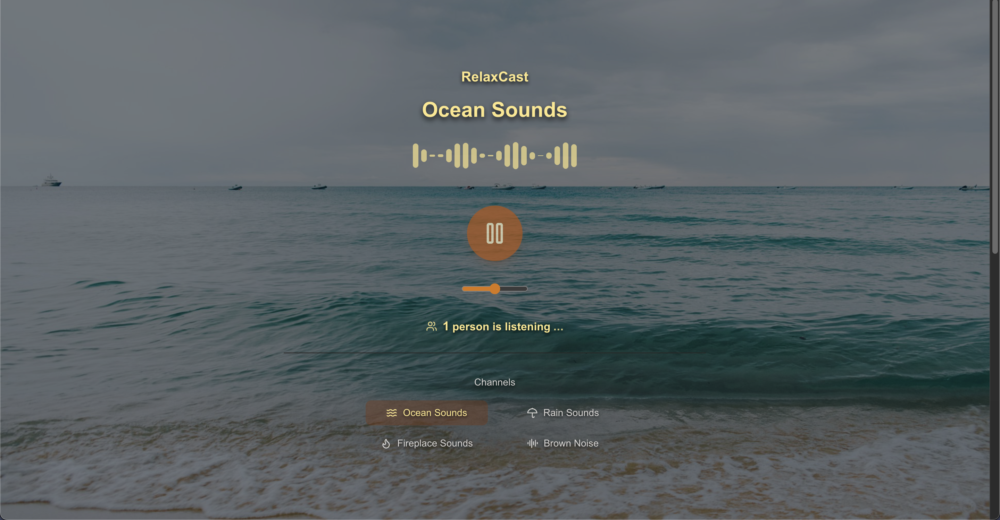

# RelaxCast

Relaxing sounds, anytime and anywhere. 

## How to build
1. npm install
2. npm run build
3. npm run start
4. Open your browser and navigate to `http://localhost:3000`
5. Enjoy the relaxing sounds!

## Streaming server
https://github.com/masakifukunishi/relaxcast-streaming